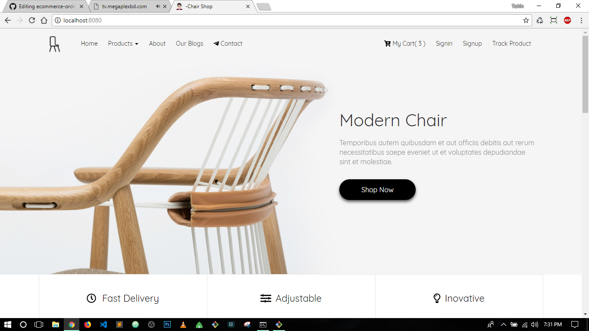
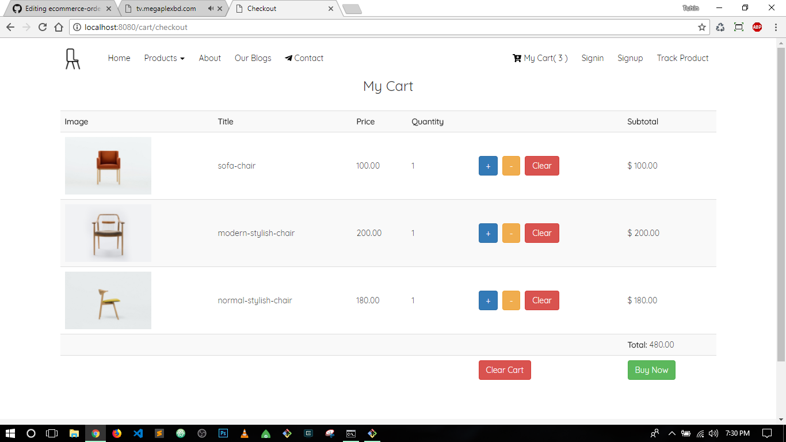
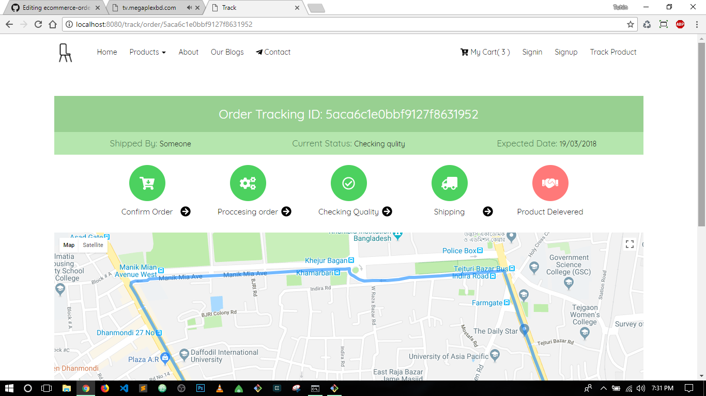
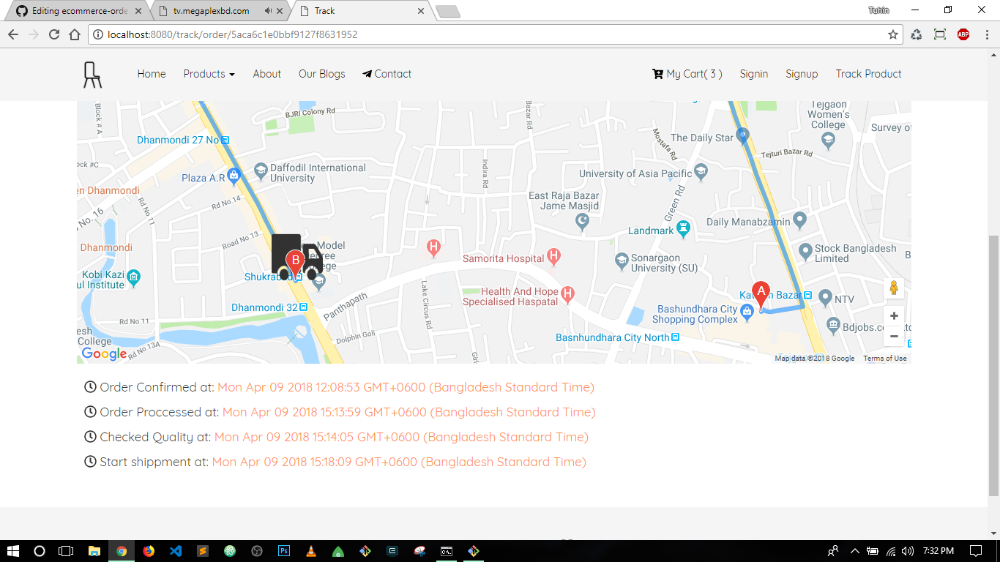
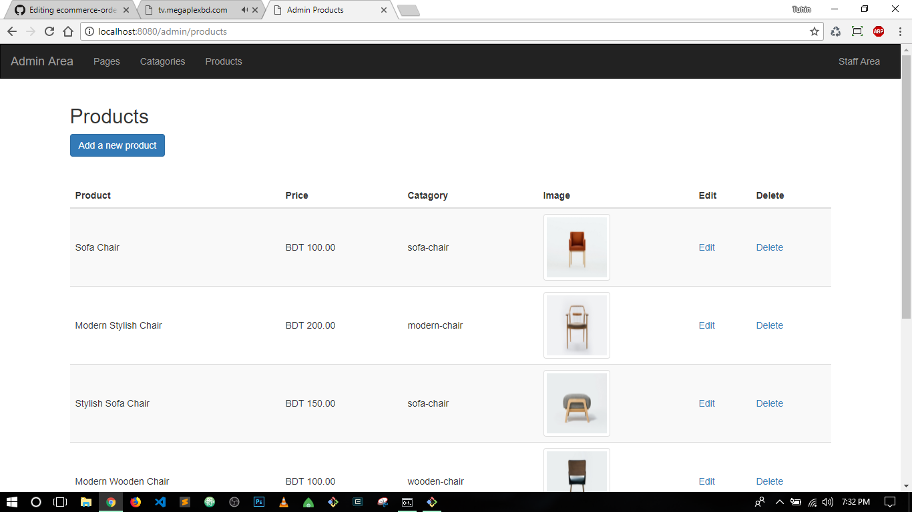
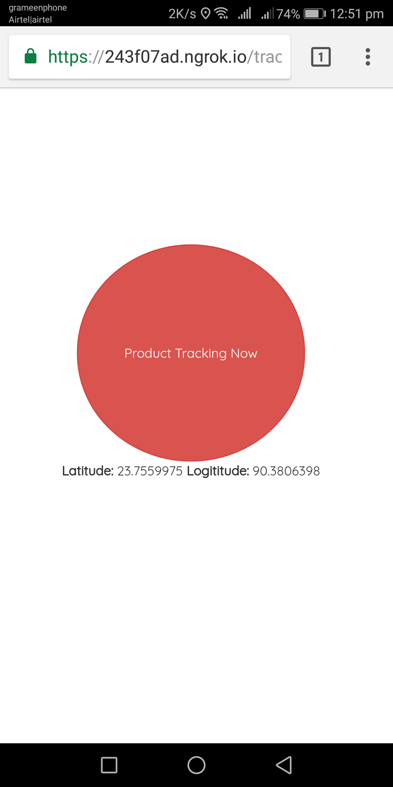

# Ecommerce-Oder-Tracking-System
<pThe order tracking system allows the customer to gain insight into where their order is
at any given point in time. From the time an order is placed until it is delivered. That
means an order tracking system needs to be able to follow and provide insight into
the status of the order through its entire journey in the Google map to the customer
until it reaches to customer door.

<h3>Why this system is necessary?</h3>
<ul>
  <li>Make e-commerce business more efficient.</li></li>
  <li>Increase customers experiences and satisfactions with below questionnaires.</li>
  <li>Has customer’s order been filled? I.e., is it picked, packed and ready to ship?</li>
  <li>Is the order correct?</li>
  <li>Are any items missing or are there problems with my order?</li>
  <li>Is my order still in the warehouse?</li>
  <li>Has my order been picked up for delivery?</li>
  <li>Where is the order right now?</li>
  <li>When will it be delivered?</li>
</ul>

Built with followig technologies

 <li><a href="https://expressjs.com/">Express</a></li>
 <li><a href="http://www.passportjs.org/">Passport</a></li>
 <li><a href="https://www.mongodb.com/">MongoDB</a></li>
 <li><a href="https://developers.google.com/maps/documentation/javascript/">Google map JavaScript API</a></li>
<h3>Installation</h3>

Clone or download

Navigate to this folder with cmd

<pre><code>$npm install</code></pre>
<pre><code>$node app.js or nodemon</code></pre>

Add the url to connect local mongodb database

<pre><code>mongodb://localhost:27017/your-db-name</code></pre>
<h3>Home Page</h3>

<h3>Cart</h3>

<h3>Tracking Page</h3>

<h3>Admin area</h3>

<h3>Add product to track by deliveryman</h3>

<h3>Future plans</h3>
<li>Integrete payment method</li>
<li>Add search functionalities</li>
<li>Add feedback system</li>

Made with love <3 by Tuhin

